# py-ard Architecture

This document provides a comprehensive overview of the py-ard project architecture, designed to help new developers understand the codebase and contribute effectively.

## Table of Contents

1. [Overview](#overview)
2. [High-Level Architecture](#high-level-architecture)
3. [Core Components](#core-components)
4. [Data Flow](#data-flow)
5. [Module Details](#module-details)
6. [Design Patterns](#design-patterns)
7. [Database Schema](#database-schema)
8. [Extension Points](#extension-points)

---

## Overview

`py-ard` is a Python library for HLA (Human Leukocyte Antigen) nomenclature reduction and manipulation. It reduces HLA typings to various resolution levels (G group, P group, lg, lgx, etc.) based on IPD-IMGT/HLA database releases.

**Key Features:**
- Multiple reduction strategies (G, P, lg, lgx, W, exon, U2, S)
- MAC code expansion and lookup
- Serology to allele mapping
- V2 to V3 allele conversion
- GL String processing
- CWD (Common and Well-Documented) reduction
- REST API service
- Command-line tools

---

## High-Level Architecture

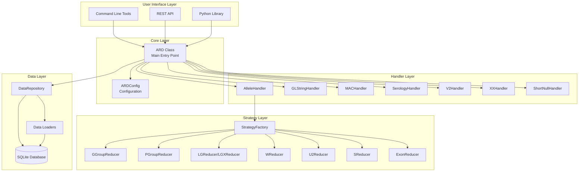

---

## Core Components

### 1. ARD Class (`pyard/ard.py`)

The main entry point and orchestrator for all HLA reduction operations.

**Responsibilities:**
- Initialize database connections and load reference data
- Coordinate between handlers for different typing formats
- Manage caching for performance optimization
- Provide public API for reduction operations

**Key Methods:**
- `redux(glstring, redux_type)` - Main reduction method
- `expand_mac(mac_code)` - Expand MAC codes
- `lookup_mac(allele_list)` - Find MAC for allele list
- `validate(glstring)` - Validate GL strings
- `cwd_redux(allele_list)` - CWD reduction

### 2. Configuration (`pyard/config.py`)

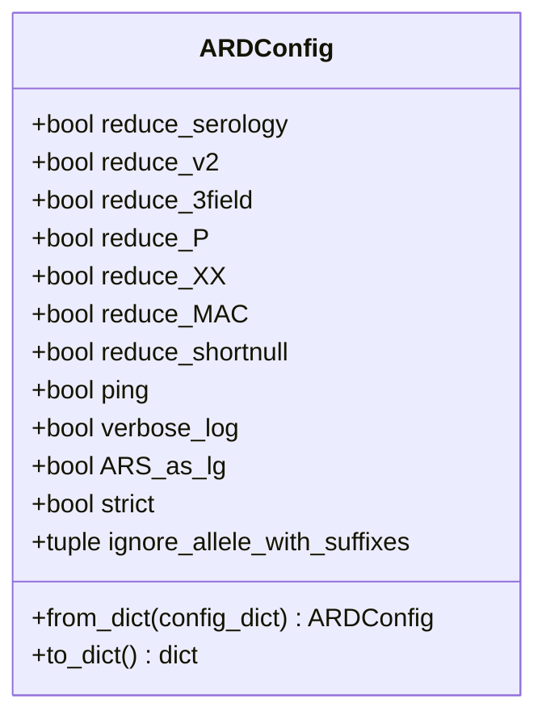

Manages all configuration options for reduction behavior.

### 3. Handlers (`pyard/handlers/`)

Specialized handlers for different typing formats:

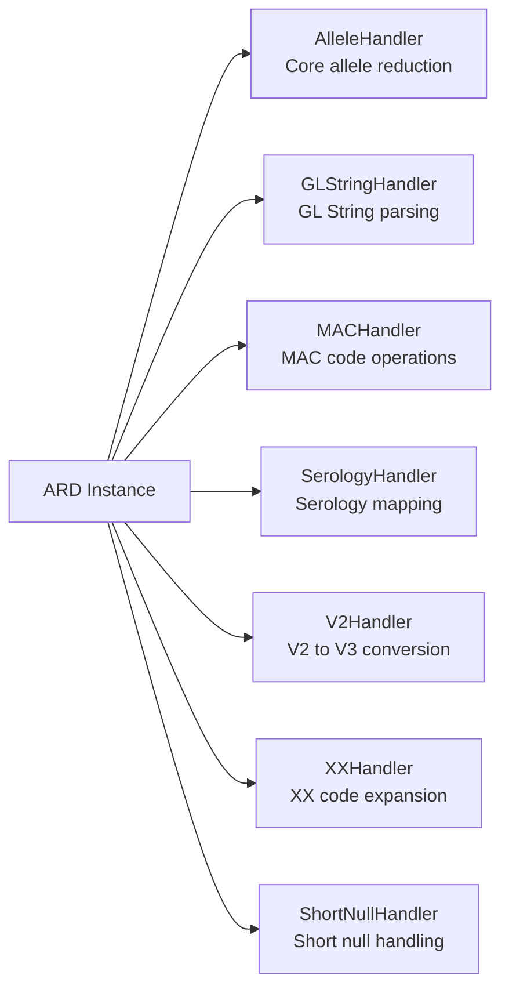

**AlleleHandler** - Delegates to reduction strategies via StrategyFactory
**GLStringHandler** - Parses and processes GL Strings with delimiters (`/`, `+`, `^`, `~`)
**MACHandler** - Expands and looks up MAC (Multiple Allele Codes)
**SerologyHandler** - Maps serology to alleles and handles broad/split relationships
**V2Handler** - Converts V2 allele names to V3 format
**XXHandler** - Expands XX codes to allele lists
**ShortNullHandler** - Handles short null alleles (e.g., `A*01:01N`)

---

## Data Flow

### Reduction Flow

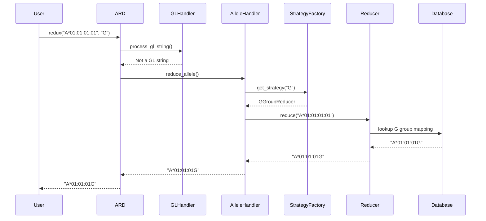

### Initialization Flow

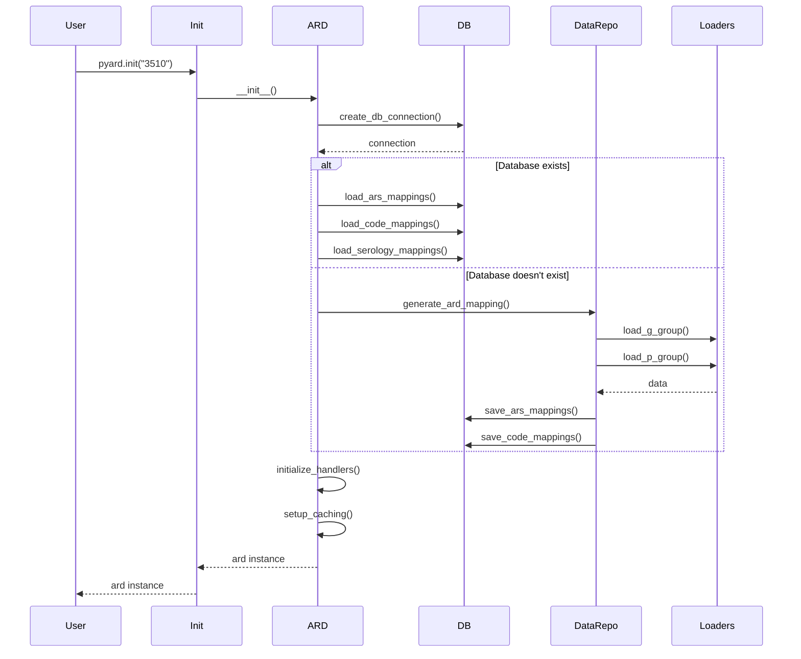

---

## Module Details

### Data Repository (`pyard/data_repository.py`)

Manages data loading and transformation from IPD-IMGT/HLA releases.

**Key Functions:**
- `generate_ard_mapping()` - Creates G/P/lgx/exon group mappings
- `generate_alleles_and_xx_codes_and_who()` - Generates allele lists and XX codes
- `generate_serology_mapping()` - Creates serology to allele mappings
- `generate_mac_codes()` - Loads MAC codes from NMDP service
- `generate_short_nulls()` - Creates short null mappings
- `generate_cwd_mapping()` - Loads CWD allele lists

### Database Layer (`pyard/db.py`)

SQLite database operations for persistent storage.

**Key Tables:**
- `g_group` - G group mappings
- `p_group` - P group mappings
- `lgx_group` - lgx group mappings
- `exon_group` - Exon mappings
- `alleles` - Valid alleles
- `who_alleles` - WHO nomenclature alleles
- `mac_codes` - MAC code expansions
- `serology_mapping` - Serology to allele mappings
- `xx_codes` - XX code expansions
- `shortnulls` - Short null mappings
- `cwd2` - CWD Version 2 alleles
- `v2_mapping` - V2 to V3 conversions

### Reducers (`pyard/reducers/`)

Strategy pattern implementation for different reduction types.

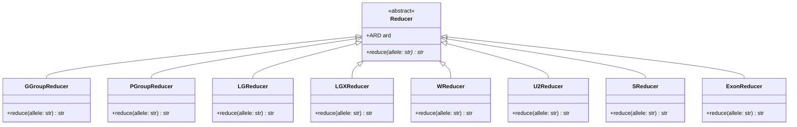

**Reducer Types:**
- **GGroupReducer** - Reduces to G group level (e.g., `A*01:01:01G`)
- **PGroupReducer** - Reduces to P group level (e.g., `A*01:01P`)
- **LGReducer** - Reduces to 2-field with 'g' suffix (e.g., `A*01:01g`)
- **LGXReducer** - Reduces to 2-field without suffix (e.g., `A*01:01`)
- **WReducer** - WHO nomenclature expansion
- **U2Reducer** - 2-field unambiguous reduction
- **SReducer** - Serology reduction (e.g., `A1`)
- **ExonReducer** - 3-field exon reduction

### Loaders (`pyard/loader/`)

Load reference data from IPD-IMGT/HLA releases.

**Modules:**
- `allele_list.py` - Loads allele list from IPD-IMGT/HLA
- `g_group.py` - Loads G group definitions
- `p_group.py` - Loads P group definitions
- `mac_codes.py` - Fetches MAC codes from NMDP service
- `serology.py` - Loads serology mappings
- `cwd.py` - Loads CWD allele lists
- `version.py` - Fetches available IPD-IMGT/HLA versions

---

## Design Patterns

### 1. Strategy Pattern

Used for reduction algorithms to allow runtime selection of reduction strategy.

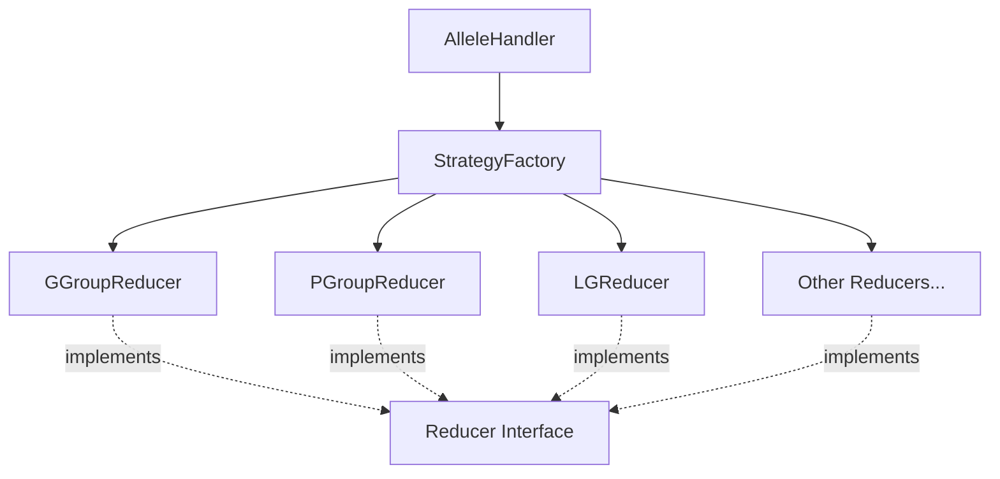

**Benefits:**
- Easy to add new reduction types
- Separation of concerns
- Runtime strategy selection

### 2. Handler Pattern

Specialized handlers for different typing formats.

**Benefits:**
- Single responsibility principle
- Easier testing and maintenance
- Clear separation of concerns

### 3. Repository Pattern

DataRepository abstracts data access and transformation.

**Benefits:**
- Decouples business logic from data access
- Centralized data management
- Easier to test with mock data

### 4. Factory Pattern

StrategyFactory creates appropriate reducer instances.

**Benefits:**
- Centralized object creation
- Encapsulates instantiation logic
- Easy to extend with new strategies

---

## Database Schema

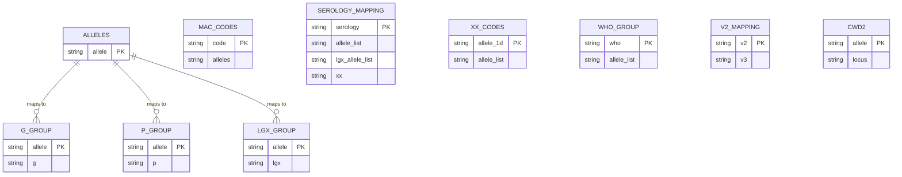

---

## Extension Points

### Adding a New Reduction Type

1. **Create a new reducer class** in `pyard/reducers/`:

```python
from .base_reducer import Reducer

class MyCustomReducer(Reducer):
    def reduce(self, allele: str) -> str:
        # Implement custom reduction logic
        return reduced_allele
```

2. **Register in StrategyFactory** (`pyard/reducers/reducer_factory.py`):

```python
def _initialize_strategies(self):
    self._strategies = {
        # ... existing strategies
        "CUSTOM": MyCustomReducer(self.ard),
    }
```

3. **Update constants** (`pyard/constants.py`):

```python
VALID_REDUCTION_TYPE = Literal["G", "P", "lg", "lgx", "W", "exon", "U2", "S", "CUSTOM"]
```

### Adding a New Handler

1. **Create handler class** in `pyard/handlers/`:

```python
class MyHandler:
    def __init__(self, ard_instance):
        self.ard = ard_instance

    def process(self, input_data):
        # Implement handler logic
        pass
```

2. **Initialize in ARD class** (`pyard/ard.py`):

```python
def _initialize_handlers(self):
    # ... existing handlers
    self.my_handler = MyHandler(self)
```

### Adding New Data Sources

1. **Create loader** in `pyard/loader/`:

```python
def load_my_data(imgt_version):
    # Fetch and parse data
    return data_table
```

2. **Add to DataRepository** (`pyard/data_repository.py`):

```python
def generate_my_mapping(db_connection, imgt_version):
    if not db.table_exists(db_connection, "my_table"):
        data = load_my_data(imgt_version)
        db.save_dict(db_connection, "my_table", data, ("key", "value"))
```

3. **Call during initialization** in `ARD._initialize_database()`.

---

## Command-Line Tools

### Tool Architecture

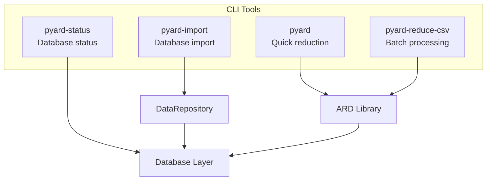

**Tools:**
- `pyard` - Interactive reduction tool
- `pyard-import` - Import/update IPD-IMGT/HLA database
- `pyard-status` - Show database status and statistics
- `pyard-reduce-csv` - Batch process CSV files

---

## REST API Architecture

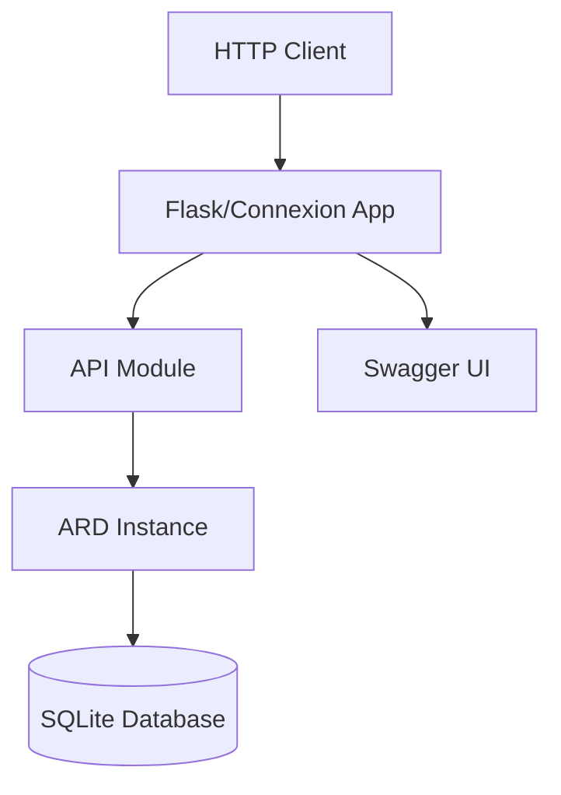

**Endpoints:**
- `POST /redux` - Reduce GL strings
- `POST /expand_mac` - Expand MAC codes
- `POST /lookup_mac` - Lookup MAC for allele list
- `GET /version` - Get database version
- `GET /ui` - Swagger UI

**Deployment:**
- Development: Flask built-in server
- Production: Gunicorn/Uvicorn with Docker

---

## Performance Considerations

### Caching Strategy

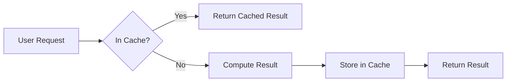

**Cached Methods:**
- `redux()` - Main reduction method
- `_redux_allele()` - Core allele reduction
- `is_mac()` - MAC validation
- `smart_sort_comparator()` - Sorting comparator

**Cache Size:**
- Default: 1,000 entries
- Configurable via `cache_size` parameter
- LRU (Least Recently Used) eviction policy

### Database Optimization

- **Read-only connections** for thread safety
- **Indexed lookups** on primary keys
- **Frozen reference data** (Python 3.9+) for memory efficiency
- **Batch operations** for data loading

---

## Testing Architecture

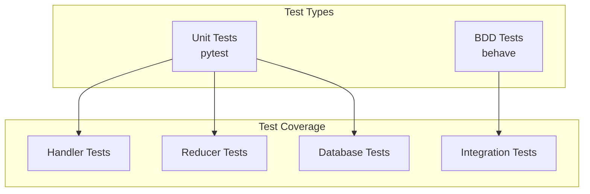

**Test Structure:**
- `tests/unit/` - Unit tests for individual components
- `tests/features/` - BDD feature files
- `tests/steps/` - BDD step implementations

---

## Contributing Guidelines

### Code Organization

1. **Handlers** - Add new typing format handlers in `pyard/handlers/`
2. **Reducers** - Add new reduction strategies in `pyard/reducers/`
3. **Loaders** - Add new data loaders in `pyard/loader/`
4. **Utilities** - Add helper functions in `pyard/misc.py`

### Best Practices

- Follow existing code style and patterns
- Add type hints for new functions
- Write unit tests for new functionality
- Update documentation for API changes
- Use descriptive variable and function names
- Keep functions focused and single-purpose

### Development Workflow

1. Fork and clone repository
2. Create virtual environment: `make venv`
3. Install dependencies: `make install`
4. Make changes and add tests
5. Run tests: `make test`
6. Submit pull request

---

## Glossary

- **ARD** - Antigen Recognition Domain
- **HLA** - Human Leukocyte Antigen
- **IPD-IMGT/HLA** - International ImMunoGeneTics HLA Database
- **MAC** - Multiple Allele Code
- **GL String** - Genotype List String (format for representing HLA typings)
- **CWD** - Common and Well-Documented alleles
- **G Group** - Group of alleles with identical nucleotide sequences across exons 2 and 3
- **P Group** - Group of alleles with identical protein sequences
- **Serology** - Serological antigen typing (older HLA typing method)
- **V2/V3** - Version 2/Version 3 of HLA nomenclature
- **XX Code** - Placeholder for all alleles at a given resolution

---

## Additional Resources

- [IPD-IMGT/HLA Database](https://www.ebi.ac.uk/ipd/imgt/hla/)
- [HLA Nomenclature](http://hla.alleles.org/nomenclature/index.html)
- [GL String Specification](https://glstring.org/)
- [NMDP Bioinformatics](https://bioinformatics.bethematchclinical.org/)

---

**Document Version:** 1.0
**Last Updated:** 2024
**Maintainer:** NMDP Bioinformatics Team
